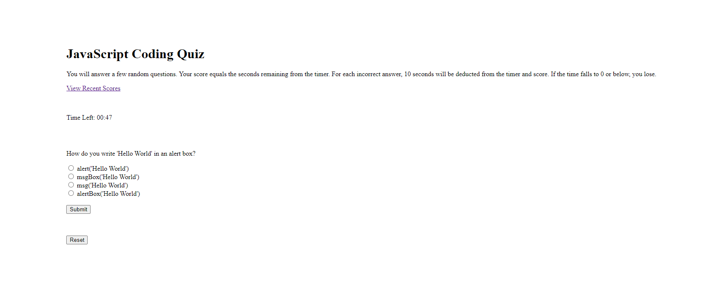

# code-quiz

## Description 

This project is a code quiz that tests your knowledge on JavaScript. The primary goal is to gather as many points as possible. The overall points equals to the amount of time left, and if you answer a question incorrectly, 10 seconds will be deducted. The application asks for your name first, before sending you to a menu consisting of options to view your recent scores, start the quiz, and reset your scores. I was able to use my knowledge in order to design a user-friendly and interactive web application, and showcase my JavaScript proficiency along with creating a dynamic and responsive user interface.

## Website URL

[My Code Quiz](https://1ncarnat10n.github.io/code-quiz/)

## Installation

No extra programs were required for this challenge.

## Usage

The following image shows the quiz's appearance and functionality:

## Credits

N/A

## License

N/A
